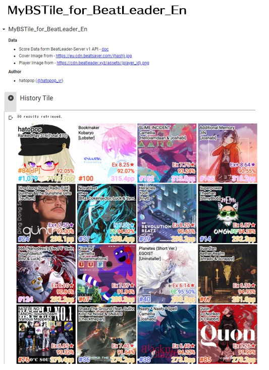

# MyBSTile_for_BeatLeader
The [Google Colab Notebook](https://colab.research.google.com/github/hatopopvr/MyBSTile_for_BeatLeader/blob/main/MyBSTile_for_BeatLeader_En.ipynb)
 to displays BeatSaber's play history in a tiled format.  
This repository for [BeatLeader](https://www.beatleader.xyz/dashboard).  
For [ScoreSaber](https://scoresaber.com/) -> [MyBSTile](https://github.com/hatopopvr/MyBSTile)

## Data
<b>Data</b>
- Score Data form BeatLeader-Server v1 API - [doc](https://api.beatleader.xyz/swagger/index.html)  
- Cover Image from - https://eu.cdn.beatsaver.com/{hash}.jpg
- Player Image from - https://cdn.beatleader.xyz/assets/{player_id}.png
## how to use

1. When the [notebook](https://colab.research.google.com/github/hatopopvr/MyBSTile_for_BeatLeader/blob/main/MyBSTile_for_BeatLeader_En.ipynb)  opens, input information below.
 - `player_id` : enter the BeatLeader PlayerID (=ScoreSaberID).
 - `sort_type` : Select `pp` or `date` (or etc.) as the content to be retrieved. 
 - `player_visible` : Whether to include player images in tiles.
 

 
2. Press the `Runtime` tab, then Press the `Run All` or `Restart and Run All` button to get the results.  
  (Please run it despite the warning.)

## Author
- hatopop ([@hatopop_vr](https://twitter.com/hatopop_vr))

## Special Thanks
- Uragirimono([@lovekyaru](https://twitter.com/lovekyaru)) : Thanks for the request and the idea.
- blaze_5161([@blaze_5161](https://twitter.com/blaze_5161)) : Thanks for the API information.
- hoshinohito([@tanakamitaina](https://twitter.com/tanakamitaina)) : Thanks for the idea.
