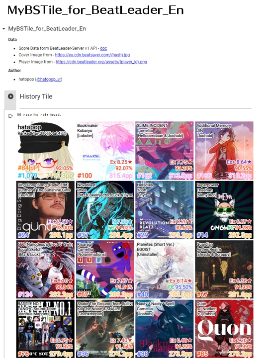
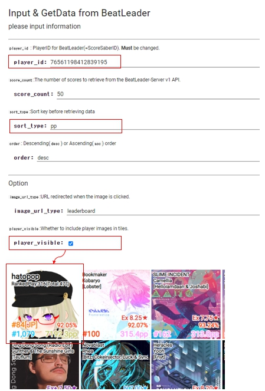
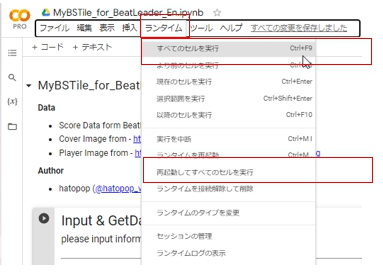

# MyBSTile_for_BeatLeader
[BeatLeader]((https://www.beatleader.xyz/dashboard)のデータを用いてBeatSaberのプレイ履歴データのタイル表示を行う[Google Colab Notebook](https://colab.research.google.com/github/hatopopvr/MyBSTile_for_BeatLeader/blob/main/MyBSTile_for_BeatLeader_En.ipynb) です。  
[ScoreSaber](https://scoresaber.com/)用は[MyBSTile](https://github.com/hatopopvr/MyBSTile)を使用ください。

## データ元
- Scoreデータ元 - ScoreSaber Public API - [doc](https://docs.scoresaber.com/)  
- Cover画像元 - https://cdn.scoresaber.com/covers/{hash}.png  

- Scoreデータ元 - BeatLeader-Server v1 API - [doc](https://api.beatleader.xyz/swagger/index.html)  
- Cover画像元 - https://eu.cdn.beatsaver.com/{hash}.jpg
- Player画像元 - https://cdn.beatleader.xyz/assets/{player_id}.png

## 使い方

1. [notebook](https://colab.research.google.com/github/hatopopvr/MyBSTile_for_BeatLeader/blob/main/MyBSTile_for_BeatLeader_En.ipynb) を開き、以下の情報を入力します。
 - `player_id` : BeatLeaderのPlayerIDを入力してください。 (ScoreSaberと同じです。)
 - `view_score_type` : 取得する内容を`top` か`recent`か選択してください。 
 - `sort_type` : 取得する内容を `pp` 順、 `date` 順等選択してください。
 - `player_visible` : プレイヤー画像をタイルに追加する場合は有効にしてください。
 

 
2. `ランタイム`タブを選択し、 `すべてのセルを実行`か `再起動してすべてのセルを実行` を選択し、実行すると結果が得られます。  
　(※警告は無視して実行してください)

## 作者
- hatopop ([@hatopop_vr](https://twitter.com/hatopop_vr))

## 謝辞
- Uragirimono([@lovekyaru](https://twitter.com/lovekyaru)) : リクエストとアイデアをありがとうございます。
- blaze_5161([@blaze_5161](https://twitter.com/blaze_5161)) : BeatLeader APIの情報をありがとうございます。
- hoshinohito([@tanakamitaina](https://twitter.com/tanakamitaina)) : BeatLeaderとScoreSaber版の区別法のアイデアをありがとうございます。